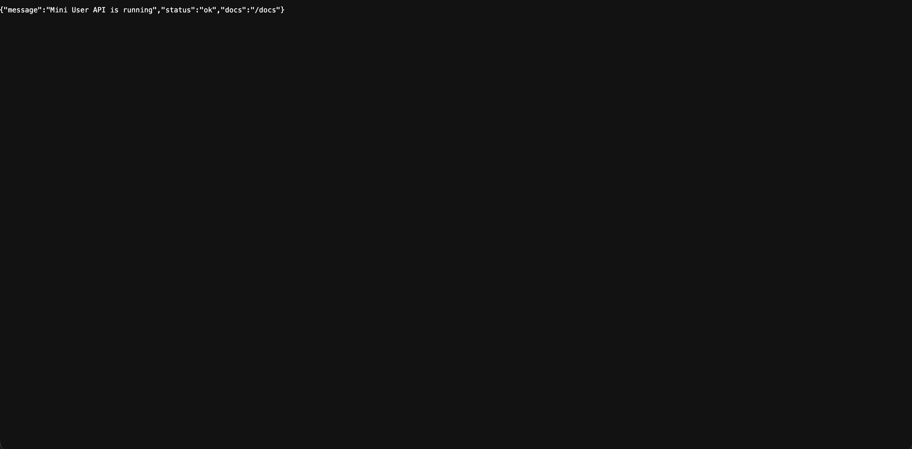
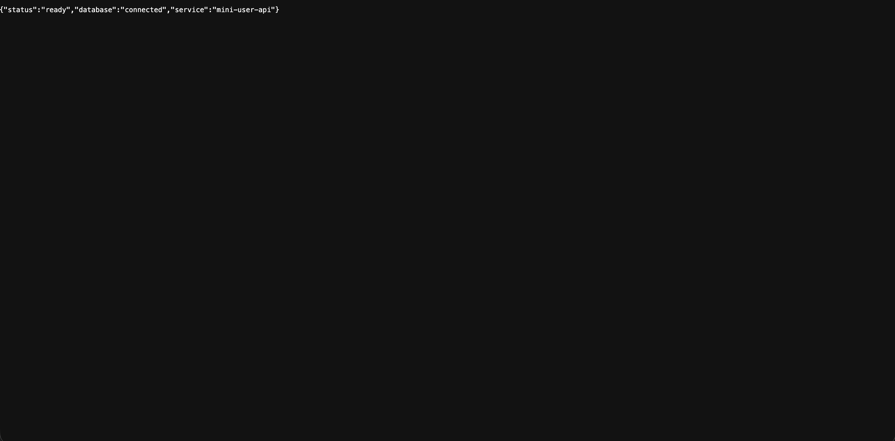
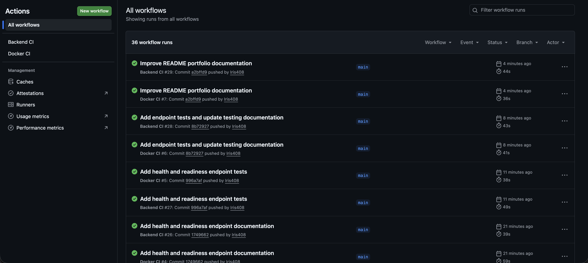
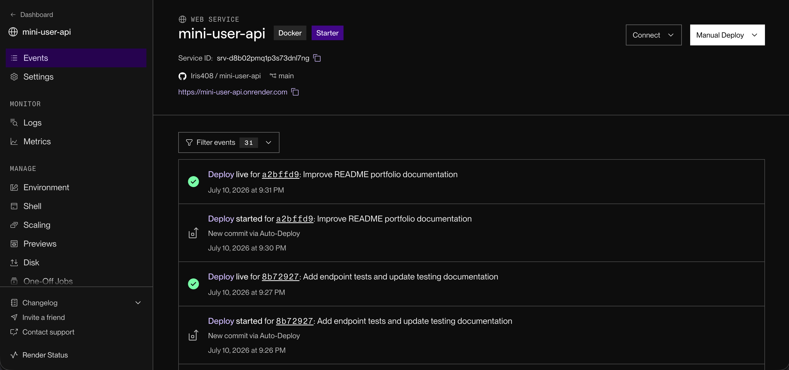

# Secure User Management API

A production-style FastAPI backend for secure user management, JWT authentication, role-based access control and PostgreSQL persistence.

## Live Demo

JWT backend deployed on Render:

- [Root Endpoint](https://mini-user-api.onrender.com)
- [Health Check](https://mini-user-api.onrender.com/health)
- [Readiness Check](https://mini-user-api.onrender.com/ready)
- [Swagger API Docs](https://mini-user-api.onrender.com/docs)

## Current Status

| Area | Status |
| --- | --- |
| FastAPI backend | ✅ Complete |
| PostgreSQL database | ✅ Connected |
| SQLAlchemy ORM | ✅ Complete |
| JWT authentication | ✅ Working |
| Password hashing | ✅ Working |
| Role-based access control | ✅ Working |
| Docker support | ✅ Complete |
| Render deployment | ✅ Live |
| Swagger API documentation | ✅ Available |
| Backend tests | ✅ Basic coverage added |
| Backend CI | ✅ Passing |
| Docker CI | ✅ Passing |

## Features

- JWT authentication
- Role-based access control
- Protected user and administrator endpoints
- PostgreSQL persistence
- SQLAlchemy ORM
- Docker Compose development environment
- Automated testing with pytest
- Continuous integration with GitHub Actions

## Tech Stack

| Area | Technologies |
| --- | --- |
| Backend | Python, FastAPI, SQLAlchemy, Uvicorn |
| Database | PostgreSQL |
| Authentication | JWT, OAuth2, bcrypt password hashing |
| Testing | pytest |
| DevOps / Tooling | Docker, Docker Compose, GitHub Actions, Render, Git, GitHub |

## Screenshots

| Swagger API Docs | Root Endpoint | Health Check |
| --- | --- | --- |
|  |  |  |

| Database Readiness | GitHub Actions CI | Render Deployment |
| --- | --- | --- |
|  |  |  |

## Quick Start

Clone the repository:

```bash
git clone https://github.com/Iris408/secure-user-management-api
cd secure-user-management-api
```

Run with Docker Compose:

```bash
docker compose up --build
```

Local API:

```text
http://127.0.0.1:8002
```

Swagger Docs:

```text
http://127.0.0.1:8002/docs
```

Run tests:

```bash
docker compose exec api pytest
```

## Documentation

More detailed project documentation is available in the `docs/` folder.

| Document | Description |
| --- | --- |
| [Setup Guide](./docs/setup.md) | Environment variables, Docker setup, manual setup, and test commands |
| [API Reference](./docs/api-reference.md) | Main API endpoints and route notes |
| [Auth Flow](./docs/auth-flow.md) | JWT authentication, protected routes, and admin-only access |
| [Project Details](./docs/project-details.md) | Architecture, limitations, future improvements, and learning notes |
| [CI/CD Notes](./docs/ci-cd.md) | Backend CI and Docker CI workflow notes |

## Project Summary

Secure User Management API is a backend portfolio project built to practise real API development skills: user authentication, JWT token handling, role-based access control, PostgreSQL persistence, Dockerized development, health checks, testing, deployment, and CI/CD validation.

## Author

Built by Iris408